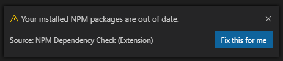
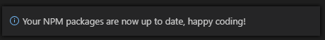
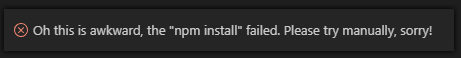

# npm-dependency-check

This plugin will help you make sure your local NPM packages are not out of date with the `package.json` specified versions.

If they were to be out of date a message will appear looking like this:

If you click the button the plugin will attempt to run `npm install` and will show you this message on success:

If the installation fails for whatever reason it will instead display this message:

## Release Notes

### 1.0.0

Intial realease. Support for `i18n`, an option to have the message open as a modal and tests to follow.
