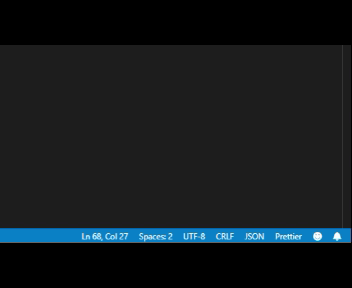

# npm-dependency-check

This extension will help you make sure your local npm packages are not out of date with the `package.json` specified versions.

If they were to be out of date a message will appear and if you click the button the plugin will attempt to run `npm install` and will show you this message on success:


If the installation, for whatever reason, fails it will instead looks something like this:



## Configuration

### Open Warning in Modal

If you want to make sure you don't miss the warning you can configure the extension to instead open it in a popup modal like this:

```json
"npm-dependency-check.openWarningInModal": false
```

## Credit

This extension is possible thanks to [installed-check](https://github.com/voxpelli/node-installed-check), go star that puppy!

## Release Notes

### 1.0.0

Intial realease. Support for `i18n`, an option to have the message open as a modal and tests to follow.

### 1.1.0

Added configuration option to have the warning message opened in a popup modal instead of the regular toaster: `npm-dependency-check.openWarningInModal`

### 1.1.1

Updated README.md and package.json with documentation and some naming convention stuff.. You know, the stuff you do while bored. Enjoy!
